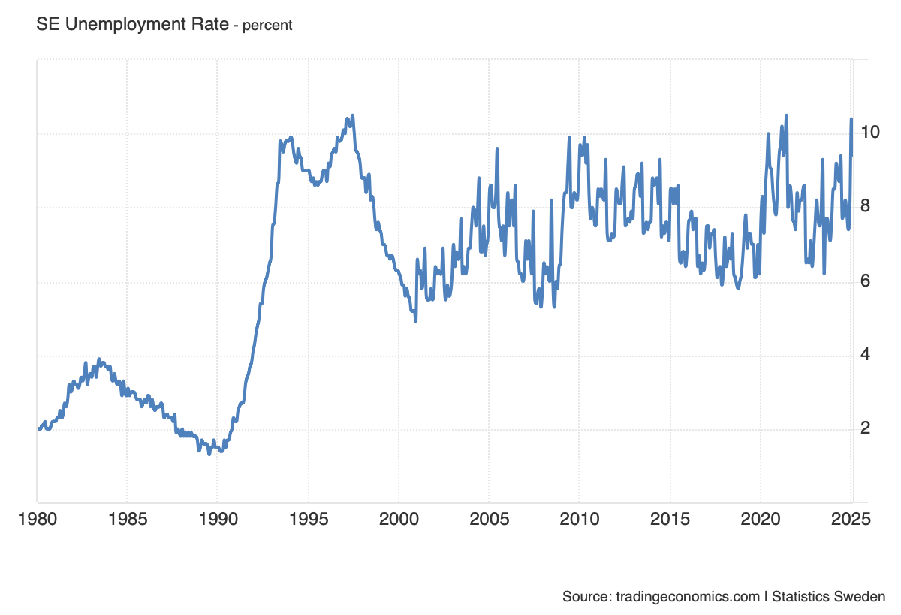
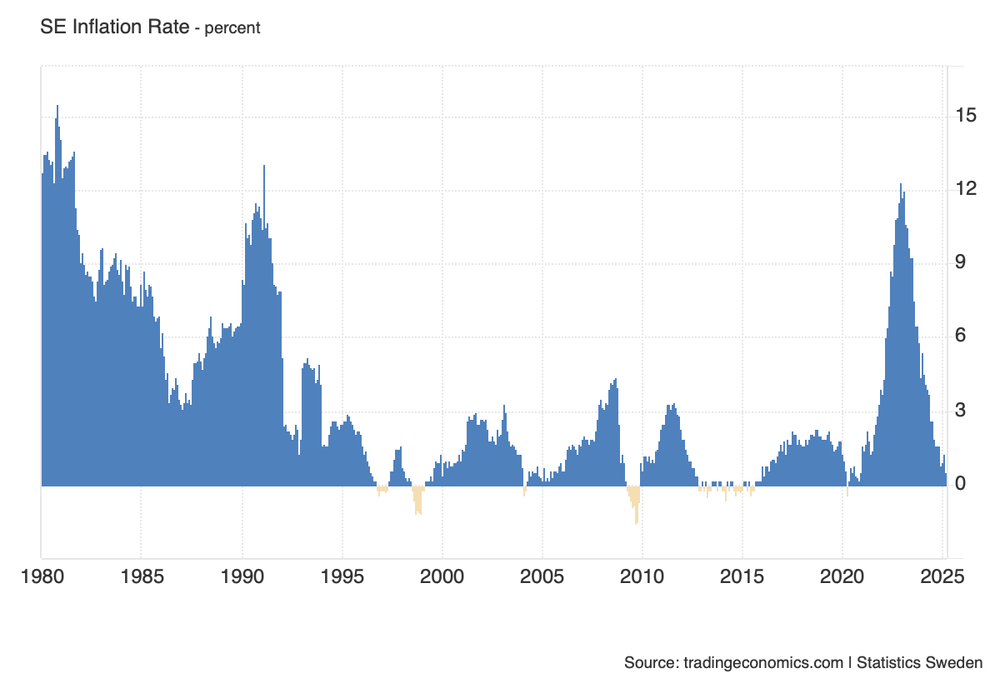
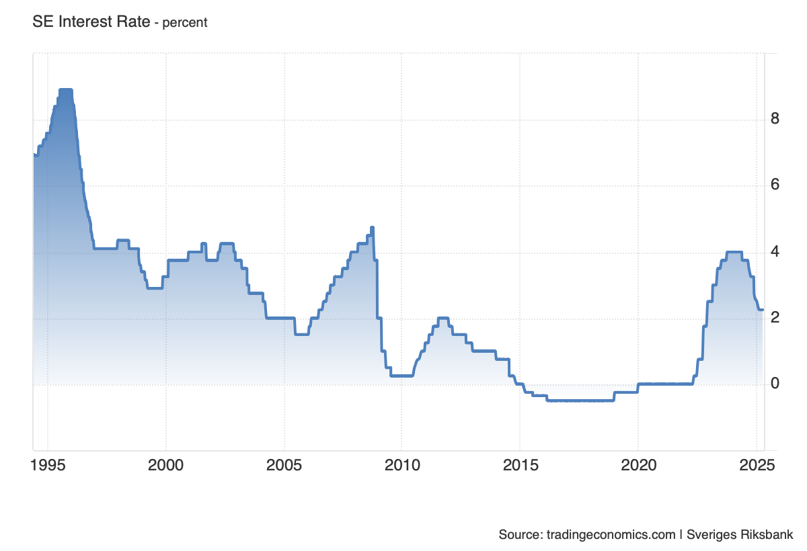
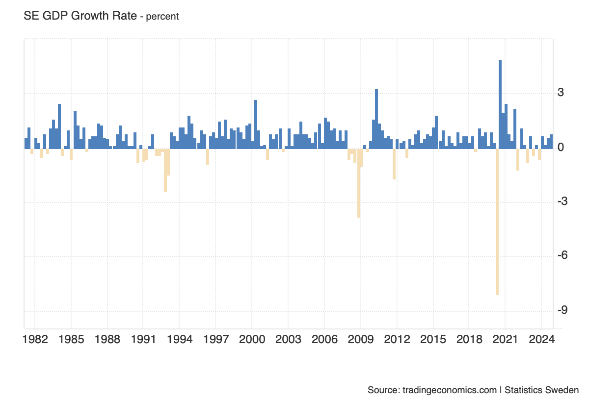
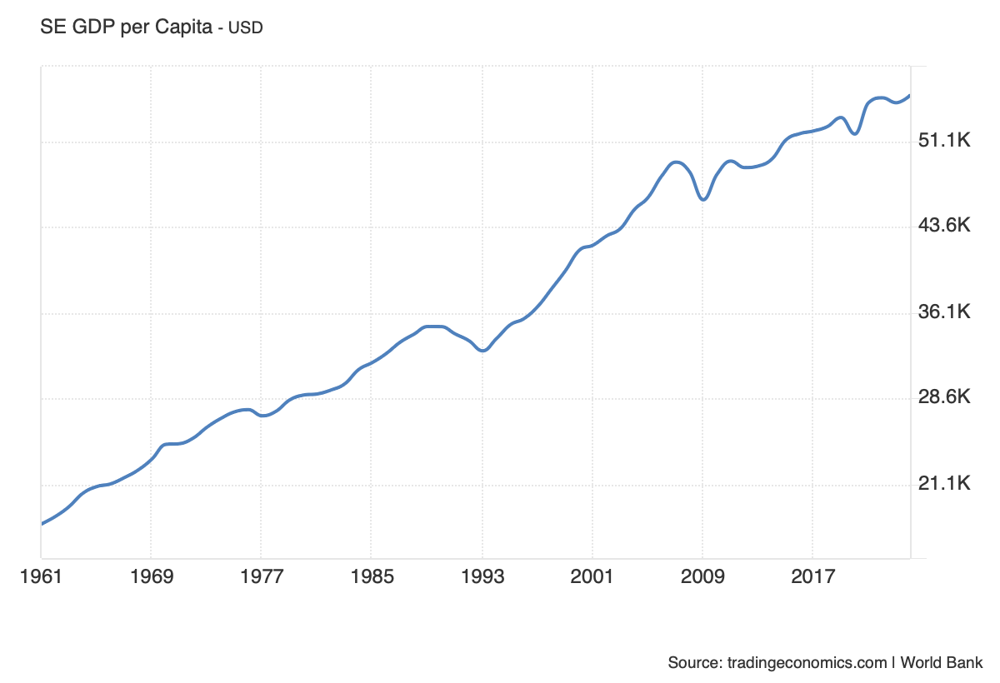
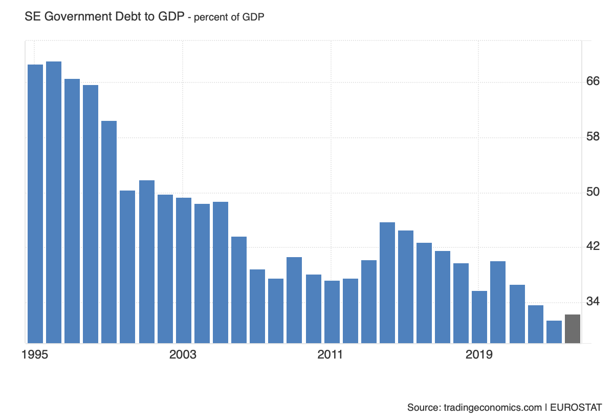

# Sweden indicators from Trading Economics

## UNEMPLOYMENT RATE

Sweden's unemployment rate rose to 9.4% in February 2025 from 8.5% in the same month of the previous year. The number of unemployed individuals increased by 53 thousand year-on-year to 533 thousand, while employment declined by 16 thousand to 5.16 million. The employment rate fell by 0.4 percentage points to 67.7%, while the labor force participation rate grew by 0.2 percentage points to 74.7%. The average total number of hours worked per week amounted to 170.5 million. On a seasonally adjusted basis, the unemployment rate increased slightly to 9.0% from 8.9% in the preceding period. source: [Statistics Sweden](https://www.scb.se/)

## INFLATION RATE

Sweden’s annual inflation rate fell to 0.5% in March 2025, confirming initial estimates, from 1.3% in February. This marked the lowest reading since December 2020 and the eighth consecutive month that inflation has remained below the Riksbank's 2% target. The slowdown in prices was particularly evident in clothing and footwear (1.4% vs 3.8% in February) and recreation and culture (0.6% vs 2.2%). Additionally, costs dropped further for housing and utilities (-2.8% vs -0.4%) and transport (-2.1% vs -0.8%). On the other hand, food inflation accelerated to a sixteen-month high (5.4% vs 3.9%), led by higher prices for coffee, chocolate, and dairy products. Meanwhile, the CPI with a fixed interest rate, the Riksbank’s target variable, rose by 2.3% in March, aligning with preliminary figures and easing from February’s one-year high of 2.9%. On a monthly basis, consumer prices decreased by 0.7% in March, the first decline since August 2024, reversing a 0.6% rise in the previous month. source: [Statistics Sweden](https://www.scb.se/)

## INTEREST RATE

The Swedish Riksbank kept its policy rate at 2.25% in March 2025, in line with expectations, citing a largely unchanged outlook for inflation and economic growth. Policymakers noted that inflation is expected to remain above target for the rest of the year but should stabilize near 2% in 2026. Meanwhile, Sweden’s economy is recovering, supported by rising real wages, lower interest expenses, and increased defense and government spending. However, risks persist, including global developments, the krona exchange rate, escalating US trade conflicts, geopolitical tensions in Europe, and shifts in household spending and corporate investment. The Riksbank reaffirmed its stable rate outlook but remains ready to adjust policy if inflation deviates, expecting a gradual return to target as monetary policy supports stability. source: [Sveriges Riksbank](https://www.riksbank.se/)

## GDP GROWTH

Sweden’s economy grew 0.8% quarter-on-quarter in Q4 2024, revised up from an initial estimate of 0.2%, and accelerated from 0.6% in Q3. This marks the strongest expansion since Q2 2022, driven primarily by net trade, as goods exports rose 0.7% (vs. 0.9% in Q3), while imports fell 0.5% (vs. -1.8%). Fixed investments sharply rebounded, rising 1.8% after stagnating in the previous quarter, while household consumption also picked up (0.7% vs. 0.2%). However, government spending growth slowed (0.1% vs. 0.4%), and changes in inventories dragged GDP down by 0.6 percentage points, mainly due to a decline in industrial inventories. On a yearly basis, GDP grew 2.4%, the fastest since Q3 2022. For the full year, the Swedish economy expanded 1%. source: [Statistics Sweden](https://www.scb.se/)

## GDP per CAPITA

The Gross Domestic Product per capita in Sweden was last recorded at 54449.80 US dollars in 2023. The GDP per Capita in Sweden is equivalent to 431 percent of the world's average. GDP per Capita in Sweden averaged 36119.88 USD from 1960 until 2023, reaching an all time high of 54878.29 USD in 2022 and a record low of 16812.15 USD in 1960. source: [World Bank](https://www.worldbank.org/)

## GOVERNMENT DEBT to GDP

Sweden recorded a Government Debt to GDP of 31.50 percent of the country's Gross Domestic Product in 2023. Government Debt to GDP in Sweden averaged 46.91 percent of GDP from 1994 until 2023, reaching an all time high of 72.40 percent of GDP in 1994 and a record low of 31.50 percent of GDP in 2023. source: [EUROSTAT](https://ec.europa.eu/eurostat/)

